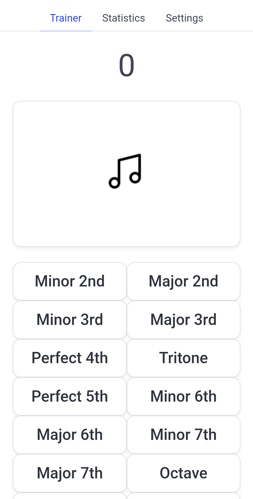
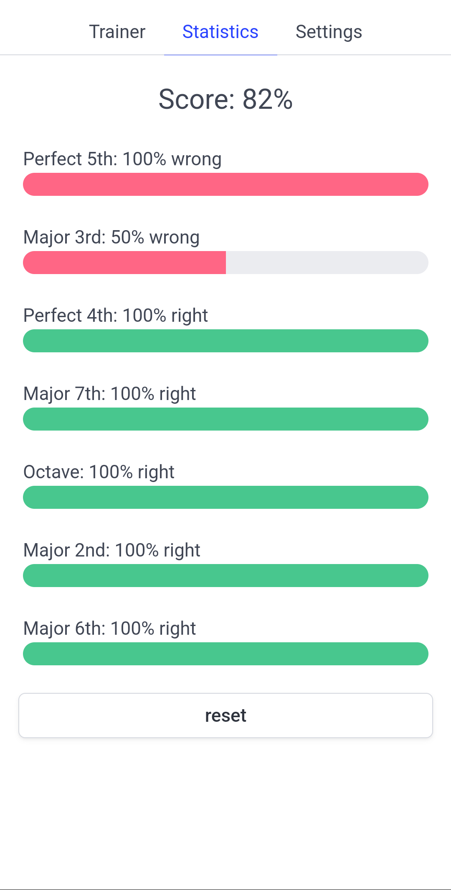

# Interval Trainer

A small app to train your ear to distinguish intervals.

## Features
- Different difficulty levels (diatonic intervals, all intervals)
- Statistics: get insight about what intervals you struggle with the most or the least

## Screenshots

    
    
    

## Installation
Download the APK from the [releases]() page.
